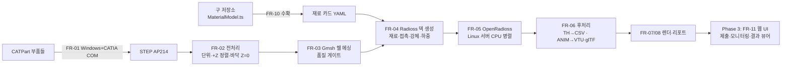

# Crush-Sim — 기술 스택 및 요구사항 정의서 v2.1

저장소: **https://github.com/doroper98/Crush-Sim** · Python 패키지 `crushsim` · CLI `csim`

원통형 캔의 압착(지그 압착력)·강도(축방향 압궤) 시뮬레이션 파이프라인.
CATPart 자산 → STEP 변환 → 쉘 메싱 → OpenRadioss 해석 → 애니메이션·리포트 자동화.

**v2.1 변경 요지**
- 프로젝트 명칭·저장소 확정: Crush-Sim.
- **UI/UX 전면 폐기 확정.** 구 프런트엔드는 코드·디자인 자산 모두 반입 금지. Phase 3에서 제로베이스 신규 (§10).
- 구 저장소 보존 목록을 축소하고 폐기 목록을 확대 (§1).

---

## 0. 구 저장소 부검 (doroper98/can_crush_sim)

### 0.1 사실 요약 (2026-03 개발, Opus 4.6)

| 항목 | 내용 |
|---|---|
| 아키텍처 | React 19 + Three.js 0.183 SPA. 정적 호스팅 전제, 서버 없음 |
| 물리 | **자체 질량-스프링 엔진 → PBD(Position-Based Dynamics)로 재작성** (웹워커 구동) |
| CAD | OCCT.js(WASM) 브라우저 내 STEP/IGES 임포트 + STL 로더 |
| 강체 | 해석적 원통 프리미티브 **1종 하드코딩** (중심좌표+반경+반높이) |
| 재료 | Ludwik-Hollomon 경화식 기반 약 240종 내장 DB (`MaterialModel.ts` 2,474줄) |
| 프로세스 | Karpathy autoresearch 패턴. EXP-454까지 수행, DEVLOG 7,568줄 |
| 성공 기준 | GOAL.md 원문: "캔 압축 변형이 **시각적으로** 재현되는 것" |

### 0.2 인정할 성과
- 실험 규율(EXP 단위 커밋, 실패 시 reset, DEVLOG·교훈 로그)은 훌륭했다. → 프로세스만 계승.
- 뷰어 UX 완성도는 높았으나, v2.1에서 자산 재사용은 하지 않기로 확정했다. 참고 이력으로만 남긴다.

### 0.3 실패 원인 — 구조적 결함 5가지 (코드 수준 확정)

**결함 1. 물리 방법 자체가 부적합. 근본 원인.**
- 질량-스프링은 엣지 길이 보존만 한다. **쉘 굽힘 강성이 없어** 좌굴 지배 현상(캔 찌그러짐)을 원리적으로 재현 불가.
- BUG-008 "메쉬 폭발"의 해법이 PBD 전환(EXP-454)이었는데, PBD compliance(코드상 `0.3/iterations`)는 **수치 안정화 계수이지 재료 물성이 아니다.** 탄성계수를 바꿔도 거동이 안 변한다. 안정성을 얻는 대가로 물리를 버린 거래.
- 응력·소성변형률은 스프링 힘 역산 추정치. 연속체 응력이 아니므로 von Mises 컬러맵은 장식이었다.

**결함 2. 단위계 혼재.** 중력 mm/s², 밀도 kg/m³, 강성 N/m 공존.
**결함 3. 접촉 모델 부재.** 해석적 원통 1개와의 페널티 밀어내기뿐. 실지그 STEP 접촉 불가.
**결함 4. 검증 부재.** 성공 기준이 "시각적 재현". 벤치마크·에너지 밸런스·수렴성 전무.
**결함 5. 노력 배분 실패.** 454개 실험의 다수가 UI(다크모드·터치·토스트). 코어가 틀린 상태에서 표면을 다듬음.

### 0.4 판정
결정적 원인은 계획 단계의 아키텍처 선택("브라우저 실시간")이다. 이 제약이 검증된 솔버 사용을 봉쇄하고 자체 게임물리로 내몰았다. **리팩토링 대상이 아니라 교체 대상.** v2.1의 모든 결정은 이 판정에서 출발한다.

---

## 1. 재사용/폐기 인벤토리 (파일 단위 판정)

### 1.1 수확 — 데이터만 추출, 코드는 버림

| 구 저장소 경로 | 내용 | 조치 |
|---|---|---|
| `src/engine/MaterialModel.ts` (L38 이후) | 약 240종 재료 물성: E, ν, ρ, σy, UTS, n, 벽두께 | **FR-10 수확 스크립트**로 YAML 카드 일괄 변환. 전량 `verified: false` |

수확 근거: Ludwik-Hollomon `σ = σy + K·εp^n`은 Johnson-Cook 준정적항 `A + B·εp^n`과 동형. (σy, K, n) → OpenRadioss /MAT/LAW2의 (A, B, n)으로 무손실 매핑된다.

### 1.2 계승 — 프로세스와 지식만 (코드 아님)

| 대상 | 조치 |
|---|---|
| `GUIDE.md` + EXP/DEVLOG 체계 | autoresearch 개발 규율을 신규 repo에 계승. 단 메트릭은 UI 점수가 아니라 **게이트 통과율·벤치마크 오차** |
| DEVLOG 교훈 로그 #1~#9 | 기술 노트로만 참조. 코드·디자인 반입 근거로 사용 금지 |

### 1.3 철저 폐기 — 코드·개념·디자인 모두 반입 금지

| 구 저장소 경로 | 폐기 사유 |
|---|---|
| `src/engine/MassSpringSystem.ts` | 결함 1. 물리 자체 구현 금지 (ADR-01) |
| `src/workers/physicsWorker.ts` | 브라우저 물리 전제 폐기 |
| `src/cad/occtLoader.ts`, `stlLoader.ts` | 서버측 OCP로 대체 |
| **`src/components/` 전체** (차트·컨트롤패널·툴바·상태바 등) | **UI/UX 전면 폐기 (ADR-07).** 제로베이스 신규 |
| **`src/viewer/` 전체** (CatiaControls·colormap·AxisHelper·recorder) | 동일 |
| GOAL.md의 뉴로모피즘 디자인 시스템·레이아웃 명세 | 동일. 신규 디자인 시스템으로 대체 (§10) |
| `MaterialModel.ts` 코드부(flowStress 등) | 데이터만 수확, 로직은 솔버 재료법칙으로 대체 |
| 성공 기준("시각적 재현"), "실시간 인터랙티브" 요구 | 정량 게이트·배치 해석으로 대체 |

---

## 2. 아키텍처 결정 기록 (ADR) — 위반 시 리뷰 반려

- **ADR-01 물리는 자체 구현하지 않는다.** OpenRadioss(explicit) 단일. 질량-스프링·PBD·자체 적분기는 폴백으로도 금지.
- **ADR-02 계산과 시각화 분리.** 계산은 서버 배치, 시각화는 결과 파일(VTU/CSV/glTF) 기반. 실시간성을 포기하고 정확성을 산다.
- **ADR-03 코어 우선, UI는 Phase 3.** Phase 0~2 인터페이스는 CLI + HTML 리포트뿐. 벤치마크 통과 전 UI 착수 금지. (결함 5 재발 방지)
- **ADR-04 단위계 단일화.** mm·s·tonne·N·MPa. `crushsim/units.py` 한 곳에서만 정의.
- **ADR-05 재료는 코드가 아니라 데이터.** YAML 카드 + `verified` 상태(unverified/literature/calibrated).
- **ADR-06 게이트 미통과 산출물은 다음 단계로 넘기지 않는다.**
- **ADR-07 UI/UX 제로베이스.** 구 프런트엔드의 코드·컴포넌트·디자인 토큰·레이아웃 반입 전면 금지. 프레임워크 선택은 자유이나 자산은 백지에서 시작한다. 설계 원칙은 §10.

---

## 3. 시스템 개요



- 실행 환경: **기본은 Windows 단일 머신으로 전 과정 수행 가능** (OpenRadioss 공식 Windows 바이너리 사용). CATIA 변환만 Windows 필수 요건이다.
- Linux 서버(또는 WSL2)는 필수가 아니라 확장 옵션이다. 파라메트릭 배치(Phase 3)에서 솔버만 이관한다. WSL2는 사내 보안정책 허용 여부 선확인.
- OpenRadioss는 GPU 미사용. CPU 코어(OpenMP) 병렬. 5만 요소급 LC-2 1건은 8~16코어에서 수십 분~2시간 수준으로 단품 검토에 충분.
- 전 과정은 `csim all --config <case.yaml>` 한 줄로 재현 가능해야 한다.

---

## 4. 기능 요구사항 (코어 파이프라인)

### FR-01 CATPart → STEP 배치 변환기 (Windows 모듈)
- pywin32로 CATIA V5 COM 구동. 폴더 단위 open→export(STEP AP214)→close 루프.
- 파일 1개 실패가 배치를 죽이지 않는다. `conversion_log.csv`(파일명·결과·오류) 필수.
- 변환 직후 OCP 재오픈 검증: 솔리드/쉘 ≥ 1, 바운딩 박스 유효, 단위 mm.

### FR-02 지오메트리 전처리
- 관성 주축으로 캔 축 추정 → +Z 정렬. 실패 시 YAML 수동 축 지정.
- 바운딩 박스 최소 Z 면 = 바닥면 → Z=0 평행이동.
- 얇은 벽 솔리드는 **외피 표면만 추출**, 두께는 파라미터 부여. 중립면 자동 추출 시도 금지.
- 지그/플래튼 STEP도 동일 처리, `rigid: true`. **임의 형상 지그 지원이 구 프로젝트와의 핵심 차별점** (구: 원통 프리미티브 1종).

### FR-03 메싱 (Gmsh Python API)
- 쿼드 우세 쉘. 목표 0.8~1.5mm, R부 곡률 세분, 최소 요소변 0.3mm 하한.
- §7 게이트 미통과 시 자동 재메싱 최대 3회 → 실패 시 불량 요소 위치 리포트와 함께 중단.

### FR-04 Radioss 덱 생성기
- .msh → starter/engine(.rad) 텍스트 덱 직접 생성(Python writer).
- 캔: /PROP/SHELL(QEPH, Ishell=24), 두께 적분점 5. 재료 /MAT/LAW2 기본, 곡선 확보 시 LAW36.
- 접촉: /INTER/TYPE7 전역, 마찰 0.15 파라미터.
- 바닥 강체(FLOOR): Z=0 고정, 6자유도 구속. 전 케이스 공통.
- 기준 강체(REF_TOOL): 메시 쉘 /RBODY, 마스터 노드 **변위 제어**(/IMPDISP). 반력은 /TH/RBODY.
- 준정적: 구동 1~5 m/s 램프, 운동E/내부E ≤ 5%, 질량 스케일링 부가질량 ≤ 2%.

### FR-05 솔버 실행 래퍼
- starter→engine 순차 실행, 스레드 설정, 로그 실시간 파싱(에너지 오차·타임스텝 급락·음의 부피 감지 시 중단 옵션).
- `run_summary.json`: 종료코드, 소요시간, 경고 요약, 커밋 해시·설정 사본 경로.

### FR-06 후처리
- /TH → 공식 `th_to_csv` → pandas: 반력-변위 곡선, 피크 하중, 흡수 에너지, 잔류 덴트 깊이.
- ANIM → 공식 `anim_to_vtk` → .vtu 시퀀스(변위·von Mises·소성변형률·두께). Phase 3용 glTF 변환 포함.
- **자체 바이너리 파서 작성 금지.**

### FR-07 애니메이션
- PyVista 오프스크린 → ffmpeg MP4 + 요약 GIF. 카메라 프리셋 3종 고정(iso/front/section).
- 컬러맵 스케일 프레임 간 고정, 자동 튐 금지.

### FR-08 자동 리포트
- 실행당 HTML 1건: 입력 요약, 메시 통계, 곡선, 에너지 밸런스 표, 게이트 판정, 애니메이션 링크.
- 곡선 PNG·GIF 별도 출력(보고·공유용).

### FR-09 파라메트릭 스터디
- YAML 매트릭스(벽두께 × 스트로크 × 재료 × 지그형상) 일괄 실행·취합 CSV.

### FR-10 레거시 재료 수확기
- 입력: 구 저장소 `src/engine/MaterialModel.ts`. AST/정규식 파싱으로 약 240종 추출 → `configs/materials/harvested/*.yaml`.

| 구 필드 | YAML | LAW2 매핑 |
|---|---|---|
| youngsModulus (MPa) | E | E |
| poissonRatio | nu | ν |
| density (kg/m³) | rho | **tonne/mm³ 환산** (×1e-12) |
| yieldStress (MPa) | sigma_y | A |
| K = (UTS−σy)/0.3^n | K | B |
| hardeningExponent | n | n |
| wallThickness (mm) | t_default | 쉘 두께 기본값 |

- 전 카드 `verified: false`, `source: legacy-can_crush_sim`.
- 실사용 후보만 문헌 대조 후 승격: 음료캔 Al3004/3104-H19(구 DB에 없음 — 신규), Al3003, 전지캔용 니켈도금강 DR급(신규), SS304.
- 미승격 카드 사용 시 리포트에 `UNVERIFIED MATERIAL` 워터마크.

---

## 5. 전역 규약

### 5.1 단위계 — mm · s · tonne · N · MPa (`crushsim/units.py` 단일 정의)
| 물리량 | 단위 | 예시(강) |
|---|---|---|
| 밀도 | tonne/mm³ | 7.85e-9 |
| 탄성계수·응력 | MPa | 210,000 |
| 힘 | N | — |
| 중력(사용 시) | mm/s² | 9,810 |

### 5.2 좌표계
캔 축 +Z, 바닥면 Z=0. FLOOR 전 케이스 공통 고정, REF_TOOL만 케이스별 교체.

### 5.3 하중 케이스
| ID | 명칭 | 기준 강체 | 구동 | 주 출력 |
|---|---|---|---|---|
| LC-1 | 축방향 압궤(강도) | 상부 평판 | −Z 변위 | 피크·평균 압궤하중, 폴딩 |
| LC-2 | 측면 지그 압착 ★본래 목적 | 평면/V블록/**실형상 CATPart 지그** | 반경방향 변위 | 압착력-덴트 곡선, 잔류 덴트 |
| LC-3 | 국부 압입 | 반구 인덴터(파라메트릭 R) | 반경방향 변위 | 국부 강성, 소성 개시 하중 |

변위 제어 기본. 좌굴 후 스냅스루에서도 해가 안정되고, 반력 곡선에서 임의 압착력의 변형을 역산할 수 있다.

---

## 6. 기술 스택 (확정)

| 영역 | 선택 | 비고 |
|---|---|---|
| 언어 | Python 3.11+, 타입힌트 필수 | 구 TS 코드베이스와 결별 |
| CAD 변환 | CATIA V5 COM (pywin32) | Windows 전용 모듈 |
| 지오메트리 | OCP (OpenCascade 바인딩) | STEP 검증·정렬·표면 추출 |
| 메싱 | Gmsh 4.13+ Python API | 쿼드 우세 쉘 |
| 솔버 | OpenRadioss 공식 릴리스, 태그 고정 | AGPL v3 — 사내 사용 무방, 외부 서비스화 시 법무 검토 |
| 후처리 | 공식 anim_to_vtk / th_to_csv | 자체 파서 금지 |
| 렌더 | PyVista 오프스크린 + imageio-ffmpeg | 헤드리스 서버 |
| 리포트 | pandas + matplotlib + Jinja2 | HTML |
| CLI | typer + YAML | 케이스는 설정으로 |
| 테스트 | pytest + 골든 벤치마크 | §8 |
| 웹 UI (Phase 3) | §10에서 정의. 구 자산 반입 금지 | ADR-07 |

---

## 7. 품질 게이트 (자동 판정, ADR-06)

**메시 게이트**: 최소 품질(SICN) ≥ 0.3 · 종횡비 ≤ 5 · 최소 요소변 ≥ 0.3mm · 삼각형 ≤ 15% · 자유 모서리 이상 없음.
**해석 게이트**: 에너지 오차 ≤ 5% · 아워글래스E/내부E ≤ 10% · 운동E/내부E ≤ 5% · 부가질량 ≤ 2%.
실패 시 원인·권장 조치를 리포트에 명시하고 결과에 `UNVERIFIED` 낙인.

---

## 8. 검증 계획 (릴리스 조건)

| ID | 벤치마크 | 기준 | 허용 |
|---|---|---|---|
| B-1 | Al 원통 축방향 압궤 | Alexander 평균 압궤하중 근사식 | ±25% |
| B-2 | 링 측면 압축(탄성) | 곡선보 이론 강성 해석해 | ±10% |
| B-3 | 메시 수렴(0.4/0.5/1.0mm) | 피크 하중 | 0.5↔0.4 차 ≤ 5% (v2.1.1: 접힘 파장 4√(Rt)≈7.3mm 분해에 1.0mm는 반파장당 3.7요소로 미달 — 쌍을 한 단계 세분) |
| B-4 | 문헌 캔 압축시험 재현 | 공개 논문 곡선 | 경향 일치 |

DI 캔의 벽두께·가공경화 높이방향 불균일 때문에, 실캔 시험 보정 전까지 모든 결과는 "경향 분석용" 표기. Phase 3에서 높이별 두께 맵 지원.

---

## 9. 개발 단계와 Day-1 착수 절차

| Phase | 범위 | 완료 판정 |
|---|---|---|
| 0. 환경 | 솔버·렌더 환경 검증 (아래 Day-1) | 공식 예제 1건의 MP4 정상 렌더 |
| 1. PoC | 파라메트릭 원통(코드 생성) + LC-1/LC-2 관통 + FR-10 수확기 | 게이트 전항 통과 + B-1·B-2 통과 |
| 2. CAD 연동 | FR-01/02, 실 CATPart 캔·지그 투입 | 실캔 LC-2 리포트 자동 생성 |
| 3. 확장·UI | 파라메트릭 스터디, 두께 맵, 실측 보정, **FR-11 웹 UI 신규 구축(§10)** | B-4 + 실측 대조 + UI 수용 기준 |

### Day-1 체크리스트 (Phase 0, Windows 단일 머신 기준)
```powershell
# 1. 신규 저장소 초기화 + 구 저장소는 읽기 전용 참조로만
git init Crush-Sim; cd Crush-Sim
git remote add origin https://github.com/doroper98/Crush-Sim.git
git clone --depth 1 https://github.com/doroper98/can_crush_sim.git legacy_ref   # git 추적 제외

# 2. Python 환경
python -m venv .venv; .venv\Scripts\activate
pip install gmsh pyvista numpy pandas typer pyyaml jinja2 matplotlib "imageio[ffmpeg]" cadquery-ocp pytest pywin32

# 3. OpenRadioss 공식 릴리스 바이너리(win64) 설치, 버전 태그를 configs/solver.yaml에 고정
#    설치·실행 플래그는 OpenRadioss README를 따른다 — 추측으로 커맨드 만들지 말 것

# 4. 오프스크린 렌더 검증 (실패 시 이후 전부 헛수고 — 구 프로젝트 교훈)
python -c "import pyvista as pv; p=pv.Plotter(off_screen=True); p.add_mesh(pv.Sphere()); p.screenshot('t.png')"

# 5. OpenRadioss 공식 예제 1건 → anim_to_vtk → PyVista → MP4까지 관통
# 6. 통과 시에만 Phase 1 진입
# (Linux 서버/WSL2로 확장 시: 동일 절차, venv 활성화만 source .venv/bin/activate)
```

---

## 10. UI/UX 요구사항 — FR-11 웹 UI (Phase 3, 제로베이스)

### 10.1 원칙 — "쉽고, 빠르고, 직관적으로"
1. **쉽다**: 기본 흐름은 3단계를 넘지 않는다. ① 모델 선택(업로드 또는 라이브러리) → ② 케이스 선택 + 핵심 파라미터(기본값 자동 채움) → ③ 실행. 전문 파라미터(접촉·질량스케일링 등)는 접힘 상태의 고급 패널로 격리한다.
2. **빠르다**: 첫 화면 로드 2초 이내, 모든 인터랙션 응답 100ms 이내. 3D 결과는 서버 산출 glTF를 점진 로드한다. 무거운 계산·파싱을 클라이언트에서 하지 않는다(ADR-02).
3. **직관적이다**: 화면의 상태가 곧 파이프라인의 상태다. 변환→메싱→해석→후처리 진행률과 게이트 판정을 실시간 표시하고, 실패 시 원인과 다음 행동을 한 문장으로 제시한다. 전문 용어에는 짧은 툴팁.

### 10.2 화면 구성 (3면 이내)
| 화면 | 역할 | 핵심 요소 |
|---|---|---|
| 제출 | 케이스 정의·실행 | 모델 선택, LC-1/2/3 카드형 선택, 파라미터 폼(기본값), 실행 버튼 |
| 모니터 | 진행 관찰 | 단계별 진행률, 라이브 로그 tail, 게이트 판정 배지, 중단 버튼 |
| 결과 | 판독 | 3D 뷰어(glTF, 변형 애니메이션·컬러맵), 하중-변위 인터랙티브 곡선, 핵심 수치 카드(피크 하중·덴트 깊이·흡수 에너지), HTML 리포트·MP4·CSV 다운로드 |

### 10.3 기술·디자인 제약
- 백엔드: 코어 파이프라인을 감싸는 얇은 API(작업 큐 + 상태 조회). UI는 이 API만 본다.
- 프런트 프레임워크 선택은 Phase 3 착수 시 결정. 단 **구 저장소의 컴포넌트·디자인 토큰·레이아웃은 어떤 형태로도 반입 금지**(ADR-07).
- 디자인 시스템은 백지에서 신규 수립한다. 템플릿 티가 나는 기성 스타일을 배제하고, 엔지니어링 도구다운 밀도와 위계를 갖춘 독자 디자인을 만든다. 뉴로모피즘은 계승하지 않는다.
- 모바일에서 모니터·결과 화면은 열람 가능해야 한다(제출은 데스크톱 우선).

### 10.4 UI 수용 기준
- [ ] 신규 사용자가 안내 없이 3분 내 첫 LC-2 실행 제출 가능
- [ ] 제출→결과까지 페이지 이동 3회 이내
- [ ] 진행 상태가 5초 이내 주기로 갱신되고, 실패 시 원인 문장이 표시됨
- [ ] 결과 3D 뷰어가 서버 데이터만으로 동작(클라이언트 물리·파싱 없음)
- [ ] 구 저장소 코드·디자인 자산 유입 0건 (리뷰 체크리스트 항목)

---

## 11. 저장소 구조

```
Crush-Sim/
├── crushsim/
│   ├── units.py         # ADR-04 단위·한계 상수 단일 정의
│   ├── harvest/         # FR-10 레거시 재료 수확기
│   ├── converter/       # FR-01 (Windows 전용)
│   ├── geometry/        # FR-02
│   ├── meshing/         # FR-03 + 게이트
│   ├── deck/            # FR-04
│   ├── solver/          # FR-05
│   ├── post/            # FR-06/07
│   └── report/          # FR-08
├── webapp/              # FR-11 (Phase 3 전까지 비움 — ADR-03)
├── configs/
│   ├── materials/harvested/   # 수확 카드 (verified: false)
│   ├── materials/verified/    # 승격 카드
│   └── cases/                 # LC-1~3 YAML
├── bench/               # §8 (pytest)
├── legacy_ref/          # 구 저장소 읽기 전용 (git 제외)
├── runs/                # 실행별 격리 출력 (git 제외)
├── GOAL.md / program.md / DEVLOG.md   # §1.2 규율 계승
└── tests/
```

---

## 12. 수용 기준 (코어)

- [ ] `csim all --config configs/cases/lc2_default.yaml` 한 줄로 (변환 제외) 전 과정 완주
- [ ] FR-10 수확기가 재료 카드 일괄 생성, 전량 unverified 태그
- [ ] 메시 게이트 실패 시 해석 미실행 + 불량 요소 리포트
- [ ] LC-2 산출물: 곡선 PNG, 덴트 깊이, MP4 3구도, HTML 리포트, 에너지 밸런스 표
- [ ] 실형상 지그 STEP으로 LC-2 접촉 해석 성공 (구 프로젝트 불가 항목)
- [ ] B-1~B-3 pytest 통과, 동일 설정 재실행 시 결과 재현
- [ ] CATPart 10개 배치에서 1개 실패 시에도 9개 정상 처리 + 로그

---

## 13. Claude Code 개발 지시

1. **복사는 화이트리스트 방식.** §1.1(재료 데이터)·§1.2(프로세스 문서) 외에는 `legacy_ref/`에서 코드 한 줄도 가져오지 않는다. UI 컴포넌트·뷰어·물리·CAD 로더는 폴백 명목으로도 반입 금지.
2. Phase 0 완료 증거(예제 MP4) 없이 Phase 1 진입 금지. 벤치마크 통과 없이 Phase 3(UI) 진입 금지.
3. 모든 수치 한계는 `crushsim/units.py` 한 곳. 하드코딩 분산 금지.
4. TH/ANIM은 공식 변환기만. 자체 바이너리 파서 금지.
5. 각 모듈은 단독 CLI 실행 가능. 실패는 예외로 크게 던진다. 조용한 빈 결과 금지.
6. EXP/DEVLOG 규율 계승. 메트릭은 게이트 통과율·벤치마크 오차.
7. UI 개발 착수 시 §10을 다시 읽고, 화면 3면·3단계 흐름·성능 예산을 설계 리뷰의 체크 항목으로 사용한다.
